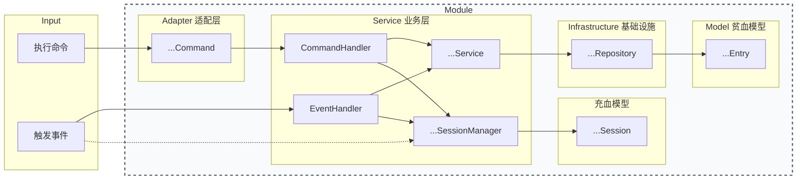

# 架构设计

> 本人经过深思熟虑、反复迭代才设计出这么一版平衡了复杂度和可维护性的架构啊。

## 模块设计

Satellite 的每个模块都基于这样的架构设计（箭头表示调用方向）：

### Adapter 适配层

只负责注册命令、传递命令调用给 handler。

### Service 业务层

`CommandHandler` 和 `EventHandler` 虽然名字上叫 handler，但和 `...Service` 构成业务层的主要部分。拆成这样是有两个原因：一是塞到一个类里太臃肿，二是这样拆分职责直观。

- Handler 的职责：**单一用途**
  - 直接对应一个命令 / 事件的业务，几乎不会复用
  - 具体业务逻辑
  
- Service 的职责：**多处复用**
  - 直接与主类对接的门面，同时持有业务层的其他对象
  
  - 比较抽象、high-level 的业务逻辑
  
  - 负责操作 repository
  

### Infrastructure 基础设施

持有 models，负责持久化数据，基本的 CRUD 和校验，不含业务逻辑。IO 时的线程安全在这一层保障。