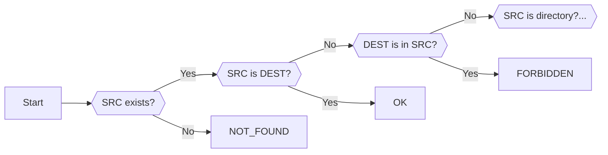
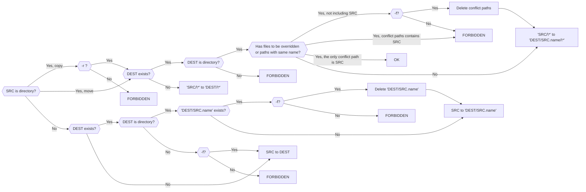

> [!note]
>
> 现在已换用 `org.apache.commons.io.file.PathUtils`，这个文档属于遗留项

## 移动 / 复制逻辑

为避免歧义，“x to y” 表示的都是文件；仅表示语义，不代表实现方式；忽略所有创建目录操作。

```mermaid
graph LR
	A[Start] --> B{{SRC exists?}} -- Yes --> C{{SRC is DEST?}} -- No --> D{{DEST is in SRC?}} -- No --> E{{SRC is directory?...}}
	D -- Yes --> F[FORBIDDEN]
	C -- Yes --> G[OK]
	B -- No --> H[NOT_FOUND]
```

```mermaid
graph LR
	D{{SRC is directory?}}
	D -- Yes, copy --> E{{-r ?}}
	E -- Yes --> F{{DEST exists?}}
	D -- Yes, move --> F
	F -- Yes --> G{{DEST is directory?}}
	G -- Yes --> H{{Has files to be overridden or paths with same name?}}
	H -- Yes, not including SRC --> I{{-f?}}
	I -- Yes --> Z[Delete conflict paths] --> J['SRC/\*' to 'DEST/SRC.name/\*']
	I -- No --> K[FORBIDDEN]
	H -- Yes, conflict paths contains SRC --> K
	H -- Yes, the only conflict path is SRC --> AA[OK]
	H -- No --> J
	G -- No --> L[FORBIDDEN]
	F -- No --> N['SRC/\*' to 'DEST/\*']
	E -- No --> O[FORBIDDEN]
	D -- No --> P{{DEST exists?}}
	P -- Yes --> Q{{DEST is directory?}}
	Q -- Yes --> R{{'DEST/SRC.name' exists?}}
	R -- Yes --> S{{-f?}}
	S -- Yes --> AB[Delete 'DEST/SRC.name'] --> T[SRC to 'DEST/SRC.name']
	S -- No --> U[FORBIDDEN]
	R -- No --> T
	Q -- No --> V{{-f?}}
	V -- Yes --> W[SRC to DEST]
	V -- No --> X[FORBIDDEN]
	P -- No --> W
```

